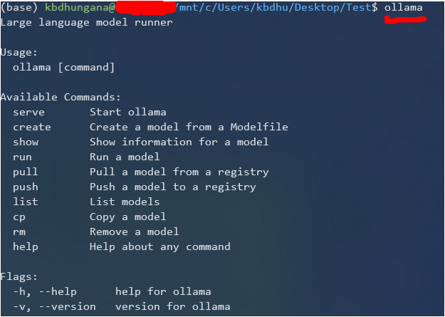
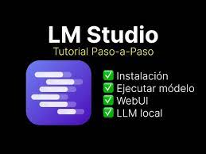
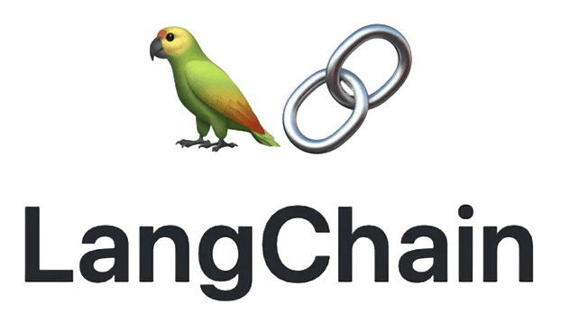

# AI Training Curriculum 
Created August 2023 
<br>Updated May 2024

```plaintext
    Do you want to learn about LLM (Large Langiuage Models)?
    AI ChatBots ?
    RAG systems (Retrieval Augmented Geenration) ?
```

Here is a short tutorial.

Prerequisites:

Computer (desktop or laptop) 
<br>with Unix OS - (because all AI is running on Unix)

You have 3 choices:

    - Linux standalone (or dual-boot) - Ubuntu, Mint, ...
    - Linux under Windows (WSL2)
    - Mac with Apple Silicone chip (M1, M2, M3, ...)

<table bgcolor="green" width="50%"><tr><td></td></tr></table>

For Linux you need a CUDA-compatible Nvidia GPU.
<br>with as much memory as you can afford.

    Nvidia RTX 3090 or 4090 with 24GB memory ($800 - $1,600)

Search for instructions to activate WSL2 (Windows Subsystem for Linux version 2)
- https://learn.microsoft.com/en-us/windows/wsl/install 
- https://learn.microsoft.com/en-us/windows/wsl/tutorials/wsl-vscode

For Mac you should get a macbook with M1, M2, or M3 chip.
<br>At least 16GB memory (but 64 or 96 or 128GB is better).
<br>And at least 1TB SSD

Here are some affordable options for you (on ebay, May 2024):
- $900 - MacBook Air 13.6" screen, M1 chip with 16GB memory, 1TB SSD
- $1,500 - MacBook Air 15" screen, M2 chip with 16GB memory, 1TB SSD
- $1,600 - MacBook Air 15" screen, M2 chip with 24GB memory, 1TB SSD

<table bgcolor="green" width="50%"><tr><td></td></tr></table>

## Prerequisites (not really required):

- Linux/Unix
- Python (Numpy, Pandas), JSON
- Basic math and statistics
- Basic Machine Learning (regression, classification)
- SQL
- Basic cloud usage: files (AWS s3, Azure data lake, etc), 
  <br>SQL databases, ETL tools, Analytics dashboards

As you go through the training materials below, you will have questions.
<br>I recommend you to use ChatBots to find answers:
 - ChatGPT ( https://chat.openai.com ) 
 - Gemini Advanced ( https://gemini.google.com ) 
 - Claude ( https://claude.ai ) 
 - Groq platform ( https://groq.com ) 
 - Huggingface ( https://huggingface.co/chat )
 - Google search

<table bgcolor="red" width="100%"><tr><td></td></tr></table>

## Lesson 1 - Introduction into Generative AI

Most popular model types - Transformer, GAN, Diffusion. 

Below are links to some materials (text, videos)
<br>It should take you 2-3 hours max 
<br>Then we can discuss on the call 

Start with watching this my old video from June 9, 2023:
<br>"Generative AI - Transformers, GANs, Stable Diffusion."
- https://www.youtube.com/watch?v=CA0Yfds-nlc

Also download updated PPT for this lecture here:
- https://github.com/lselector/seminar/tree/master/2023

Then read this illustrated description (and watch video) by Jay Alammar: 
- http://jalammar.github.io/illustrated-transformer/ 
- https://www.youtube.com/watch?v=-QH8fRhqFHM

<table bgcolor="green" width="50%"><tr><td></td></tr></table>

Excellent animated tutorials about deep learning.
<br>You may start with #5 and #6 explaining GPT and Transformers.
- https://www.youtube.com/watch?v=aircAruvnKk&list=PLZHQObOWTQDNU6R1_67000Dx_ZCJB-3pi

How ChatGPT Works Technically | ChatGPT Architecture (7min):
- https://www.youtube.com/watch?v=bSvTVREwSNw

Look at leaderboards :
- https://chat.lmsys.org/?leaderboard 
- https://huggingface.co/spaces/HuggingFaceH4/open_llm_leaderboard 

Some terms to know:

```
    - LLM = "Large Language Model"
    - word2vec (2013) 
    - Google Translate Paper "Attention is all you need", 
      attention mechanism
      transformer (Google 2016-2017)
    - tokenizer: split text into tokens
      tokens are ~ 4 chars.
      dictionary of tokens may have ~ 30K .. 120K entries
    - embeddings - numeric vectors used to represent tokens 
      or words or even chunks of text
    - encoder and decoder layers 
    - softmax function
    - Google Translate (encoder+decoder) 
      vs BERT (encoder only) 
      vs ChatGPT (decoder only)
```

<table bgcolor="red" width="100%"><tr><td></td></tr></table>

## Lesson 2 - Recent AI updates

Watch some recent AI updates on my youtube channel: 
- https://www.youtube.com/@lev-selector 

You can download all my slides here as one zip file: 
- https://github.com/lselector/seminar

I recommend the following lectures:

AI Training (Brief Introduction) - June 21, 2023 
- https://www.youtube.com/watch?v=W_2Vb9aBkao

Andrej Karpathy - Intro into LLMs - Nov 22, 2023 
- https://www.youtube.com/watch?v=zjkBMFhNj_g

AI Updates January 19, 2024 
- https://www.youtube.com/watch?v=0R5glMg69I4&t=183s

<table bgcolor="green" width="50%"><tr><td></td></tr></table>

### RAG = Retrieval Augmented Generation

    1. convert your text into vectors in vector database 
    2. convert your question into vector 
    3. do vector similarity search - retrieve best matches 
    4. re-rank/sort the findings 
    5. use LLM to convert the findings into response

Advance RAG 
- https://luv-bansal.medium.com/advance-rag-improve-rag-performance-208ffad5bb6a

Mastering RAG 
- https://www.rungalileo.io/blog/mastering-rag-how-to-architect-an-enterprise-rag-system

RAG on AWS: 
- https://aws.amazon.com/blogs/machine-learning/quickly-build-high-accuracy-generative-ai-applications-on-enterprise-data-using-amazon-kendra-langchain-and-large-language-models/

<table bgcolor="red" width="100%"><tr><td></td></tr></table>

## Lesson 3 - Ollama, LM Studio - running LLM locally

### Ollama

| Ollama             | In Terminal            |
|----------------------|----------------------|
|  |  |


Download and install Ollama from https://ollama.ai

Open terminal window (or CMD window on Windows) and type:

    ollama run llama3:latest

use terminal to chat to local model
press /bye to exit

<table bgcolor="green" width="50%"><tr><td></td></tr></table>

### LM Studio



Download and install LM Studio from https://lmstudio.ai

Use it to download and run LLMs locally

<table bgcolor="red" width="100%"><tr><td></td></tr></table>

## Lesson 4 - LangChain 

Python framework to work with LLMs 



Langchain was first released in October 2022 
<br>It was created by Harrison Chase 
<br>Written in Python and JavaScript 
- https://langchain.com 
- https://github.com/langchain-ai/langchain 
- https://en.wikipedia.org/wiki/LangChain 
- https://docs.langchain.com 
- https://python.langchain.com/docs/get_started 
- https://python.langchain.com/docs/modules/model_io/prompts/prompt_templates/ 
- https://github.com/MarekOo/ChatGPTLangChain

Andrew Ng short Coursera courses:
<br>https://learn.deeplearning.ai
- ChatGPT Prompt Engineering for Developers
- LangChain for LLM Application Development
- How Diffusion Models Work
- Building Systems with the ChatGPT API
- LangChain Chat with Your Data
- Building Generative AI Applications with Gradio ...

<table bgcolor="green" width="50%"><tr><td></td></tr></table>

<br>Search YouTube for "langchain tutorial", for example:

Using ChatGPT with YOUR OWN Data. This is magical. (LangChain OpenAI API) <br>https://www.youtube.com/watch?v=9AXP7tCI9PI

LangChain Explained in 13 Minutes | QuickStart Tutorial for Beginners <br>https://www.youtube.com/watch?v=aywZrzNaKjs

LangChain provides:
- Universal API for LLMs (GPT-3, BLOOM, and Jurassic-1 Jumbo, ...)
- Chains = sequences of commands for LLM
- End-to-end chains for popular apps (chatbots, question-answering, and summarization)
- Memory (keeping info about previous chat messages, ...)
- Tools for debugging, testing, evaluating, and monitoring LLM apps
- Prompt templates - strings containing variables in curly braces {myvar}. For example, templates for:
  - chatbots 
  - ELI5 question-answering ("Explain Like I'm Five") 
  - summarization 
  - etc
- Agents - use LLMs to decide what actions should be taken (generate a plan or execute tasks)

<table bgcolor="red" width="100%"><tr><td></td></tr></table>

## Lesson 5 - Simple Chatbots

Review several simple exampels of ChatBots
<br>under subdirectory "mychat" here:

    app_chainlit.py
    app_chainlit_ollama.py
    app_flask.py*
    app_streamlit.py
    app_streamlit_cookies.py
    chainlit.md
    images/
    templates/

Also please watch this seminar from July 14 where Malte shows chatting using LangChain, OpenAI, and ChromaDB:
- https://www.youtube.com/watch?v=8h5WBHqfoA8 
<br>slides and notebook for this presentation are here: 
- https://github.com/lselector/seminar/tree/master/2023/2023-07-14-Embeddings-Malte

__Coding tasks__: 
 - reproduce simple Chatbots under "mychat" directory
 - reproduce code from one of the tutorials using ChatGPT API and LangChain

Another example: 
<br>https://medium.com/@onkarmishra/using-langchain-for-question-answering-on-own-data-3af0a82789ed

Running model on Windows: 
<br>https://medium.com/@sasika.roledene/unlocking-llm-running-llama-2-70b-on-a-gpu-with-langchain-561adc616b16

<table bgcolor="red" width="100%"><tr><td></td></tr></table>

## Lesson 6 - Switch from Chroma DB to PostreSQL

We want to switch from Crhoma (temporary in-memory vector db)
<br>to a real local Vector Database - PostreSQL 
<br>(LangChain + LLM (ChatGPT) + OpenAI_embedding + PostreSQL)

Tasks:

install PostgreSQL locally 

install pgvector extension (slower, but can use L2 distance, inner product, and cosine distance) 

install pg_embedding for fast queries (L2 distance only) 
- https://neon.tech/blog/pg-embedding-extension-for-vector-search
- https://python.langchain.com/docs/modules/data_connection/text_embedding/ 
- https://python.langchain.com/docs/integrations/vectorstores/pgembedding

learn to use them, for example:

    SELECT * FROM my_table 
    WHERE vector @> pg_embedding_search(vector, 0.5, 10);

    SELECT * FROM my_table 
    WHERE vector @> pgvector_search(vector, 'l2', 0.5, 10);

reproduce the examples from previous lesson using langchain to
- split the document into chunks,
- convert them to embeddings (vectors)
- save these vectors into PostreSQL Database
- use ChatGPT API to answer questions using embeddings 

<table bgcolor="red" width="100%"><tr><td></td></tr></table>

## Lesson - 7 Change to use local embedding model 

Hugging Face MTEB leaderboard MTEB ( Massive Text Embedding Benchmark )
<br>https://huggingface.co/spaces/mteb/leaderboard

There are ~ 100 models.

512 tokens is fine (approx 1 page of text)

Watch this video:
"Deploy the No 1 embedding model on Huggingface with python"
<br> https://www.youtube.com/watch?v=ZB1nn3JWyec

Select the model somewhere from the top which is free and can be installed locally
<br>https://python.langchain.com/docs/integrations/text_embedding/

<table bgcolor="red" width="100%"><tr><td></td></tr></table>

## Lesson 8 -Change to use local LLM 

So here everything is local and can work without internet:
<br>LangChain + LLM + embedding + PostreSQL 

download a LLM from HuggingFace 
 - https://huggingface.co/spaces/HuggingFaceH4/open_llm_leaderboard

install and run the model locally - test the performance and accuracy

make a copy of the script from Lesson 3 - and change it to use local LLM instead of ChatGPT

<table bgcolor="red" width="100%"><tr><td></td></tr></table>

## Lesson 9 - talk-to-API 

Create a new notebook to make a conversational interface to an API. 
<br>Using OpenAI:

- https://python.langchain.com/docs/use_cases/apis 
- https://www.linkedin.com/pulse/unlocking-power-ai-transforming-your-api-natural-interface-blum/

Using Classifier 
- https://community.openai.com/t/how-to-convert-user-input-into-an-action-like-calling-api/178739

Have fun! Ask questions!

<table bgcolor="red" width="100%"><tr><td></td></tr></table>

## Lesson 10 - Make Lang-to-API transformer for financial data reporting and dashboard (charts)

Create a new jupyter notebook where you can print description of a report or chart (or a dashboard of several charts), and the code should execute on this request and produce the report or dashboard right there in the jupyter notebook.

<table bgcolor="red" width="100%"><tr><td></td></tr></table>

## Lesson 11 - Fine-tuning a model Making model smaller

<table bgcolor="red" width="100%"><tr><td></td></tr></table>

## Lesson 12 - Training our own model

<table bgcolor="red" width="100%"><tr><td></td></tr></table>


