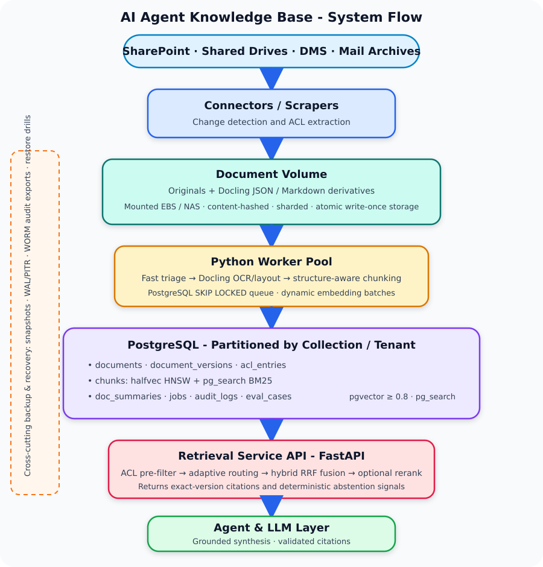
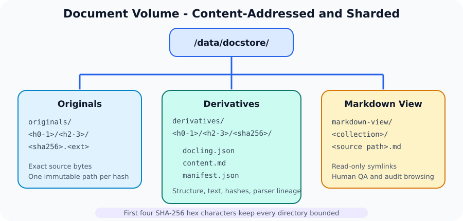
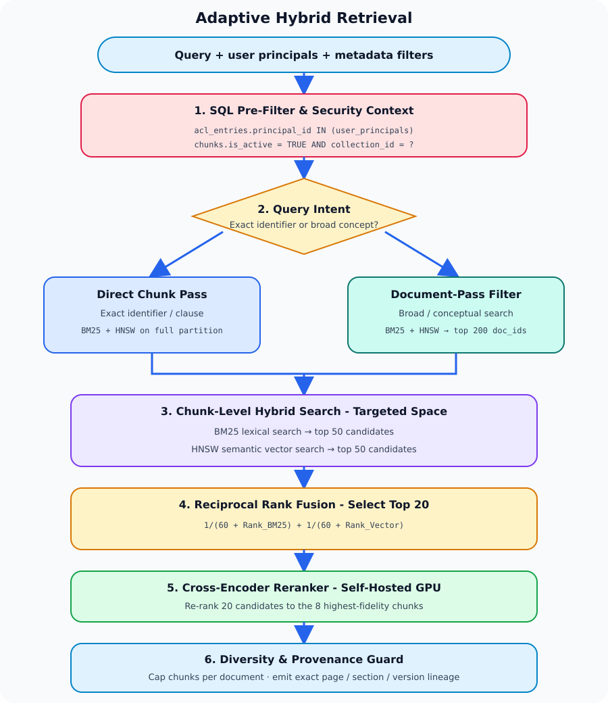
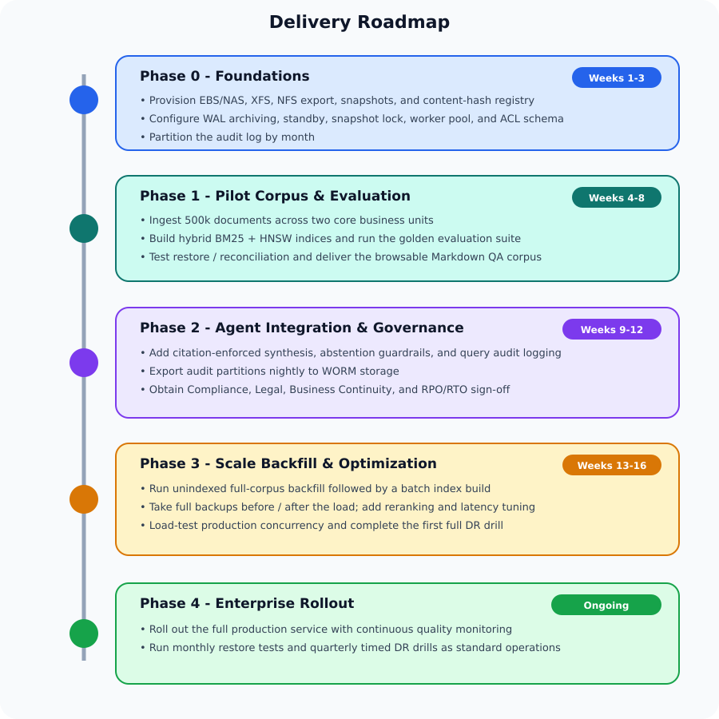

# AI Agent Knowledge Base for a Financial Company

**Requirements and Proposed Solution Architecture**

Status: Draft (pending approval) · Date: 2026-08-27

---

## Executive Summary

This document describes a retrieval-augmented AI knowledge base designed for a corpus of **millions of internal financial and legal documents** (~3M sources, 20–25M indexed chunks) in a regulated environment. Answers are grounded in the corpus with verifiable page-level citations, strict source-mirrored access controls, and a tamper-evident audit trail.

The system finds information through **three complementary search methods**, because no single method covers all question types:

1. **Semantic search (vectors)** — pgvector/HNSW embeddings match conceptual questions, themes, and paraphrases even when the wording differs from the source.
2. **Keyword search (full-text)** — BM25 exact/lexical matching catches identifiers that semantic search can miss: tickers, ISINs, clause numbers, party names, dates.
3. **Structural search (document graph & wiki)** — a typed link graph (supersession, amendments, citations, exhibits, shared entities) with temporal validity windows captures how documents relate to each other and *when*, enabling retrieval-time context expansion, point-in-time ("as-of") queries, and a human-browsable interconnected wiki for navigation, curation, and clustering.

All three run inside a **single PostgreSQL cluster** — one system of record for content indices, entitlements, the link graph, job queues, and audit logs — with originals and derivatives on mounted file volumes inside the firm's network. Specialized infrastructure (vector databases, search clusters, graph engines) is deferred behind explicit, quantitative scaling gates. Estimated footprint: ~8–10 TB document volume, ~200–300 GB database (§6.1).

---

## 1. Purpose

Build a retrieval-augmented AI agent that answers questions from a corpus of millions of internal financial and legal documents (text, PDF, Word, PowerPoint, spreadsheets, scanned files) while strictly enforcing relational access controls, producing verifiable citations, and maintaining a tamper-evident audit trail suitable for a regulated environment.

This architecture deliberately balances enterprise compliance with pragmatic simplicity: it reuses the team's established PostgreSQL operational expertise, avoids early multi-cluster sprawl (such as standalone vector databases, distributed search clusters, or external message brokers), and defines explicit quantitative gates for when specialized infrastructure becomes justified.

---

## 2. Requirements

### 2.1 Functional

| ID | Requirement |
|---|---|
| F1 | Ingest documents from multiple enterprise sources (file shares, SharePoint, email archives, document management systems) in PDF, DOCX, PPTX, XLSX, TXT, HTML, Markdown, and common scanned image formats. |
| F2 | Handle scanned documents via OCR, with extraction confidence scored and attached at the chunk/page level. |
| F3 | Preserve document hierarchy: section headers, page and slide numbers, table schemas, footnotes, and speaker notes. |
| F4 | Detect and handle exact duplicates, near-duplicates, and superseded versions with alias mapping. |
| F5 | Support hybrid retrieval — exact/lexical match (tickers, ISINs, clause numbers, dates, party names) **and** semantic match (conceptual questions, thematic synthesis, paraphrase). |
| F6 | Filter by rich metadata: source, business unit, document type, date range, classification, and language. |
| F7 | Return answers with verifiable citations at the page / slide / section / table level, deterministically linked to the exact document version used. |
| F8 | Abstain or flag uncertainty when evidence is weak, contradictory, or superseded. |
| F9 | Expose retrieval as an independent, secured REST/gRPC service consumable by the agent and other internal systems. |
| F10 | Re-index automatically upon source modification; tombstone deleted content promptly. |
| F11 | Provide a human-browsable, normalized Markdown corpus for domain expert QA, curation, and compliance audits. |
| F12 | Maintain a typed inter-document link graph (supersession, amendment, citation, exhibit, shared entities) and an entity index (parties, instruments, deals) in PostgreSQL, populated deterministically at ingestion and usable for retrieval-time context expansion (see §4.9). |
| F13 | Render the corpus as an interconnected wiki: Markdown files with YAML frontmatter and `[[wikilinks]]` (Obsidian-compatible), generated from the database and derivatives, organized in a human-navigable, grep-friendly directory tree, and scoped to authorized audiences (see §4.9.3). |
| F14 | Support point-in-time ("as-of") retrieval: an optional `as_of_date` query parameter retrieves the document versions and relationships that were in force on that date, with answers explicitly flagged as historical (see §4.9.4). |

### 2.2 Security, Compliance, and Governance

| ID | Requirement |
|---|---|
| S1 | Access control strictly mirrors source-system entitlements. ACL filters are applied **pre-ranking** at the database layer; unauthorized users can never retrieve or observe chunks from restricted documents. |
| S2 | Information barriers (ethical walls, client/deal segregation) enforced at the tenant / collection partition level. |
| S3 | Automated classification tags at ingestion: PII, MNPI, client-confidential, regulatory, and retention category. |
| S4 | Full audit log per query: user identity, evaluated roles/groups, applied filters, retrieved chunk IDs, ranking scores, model/prompt versions, generated response, and rendered citations. |
| S5 | Complete data residency: originals, derivatives, vector indices, and audit logs remain within the firm's approved security boundary. Models (embeddings, rerankers, LLMs) are self-hosted or private enterprise endpoints. |
| S6 | Release v1 is strictly **read-only**: no execution of financial transactions, external communications, or automated decisions. |
| S7 | Prompts, retrieved contexts, and outputs are archived as immutable business records under compliance supervision rules. Immutability is achieved by exporting closed audit-log partitions to write-once storage (see §4.8.3). |

### 2.3 Non-Functional

| ID | Requirement |
|---|---|
| N1 | **Corpus Scale:** Low single-digit millions of source documents; estimated 20–30 million indexed chunks after deduplication and junk exclusion. |
| N2 | **Query Latency:** p95 retrieval latency under 1.5 seconds (excluding LLM generation time). |
| N3 | **Ingestion Throughput:** Initial backfill achievable within weeks; incremental sync within minutes of source document updates. |
| N4 | **Operational Simplicity:** Minimize stateful operational dependencies. Zero multi-cluster maintenance overhead for v1. |
| N5 | **Reliability & Idempotency:** Job processing is transactional, observable, and crash-resilient with automatic retry handling. |
| N6 | **Measurable Quality:** Retrieval recall@20, citation accuracy, groundedness, and permission-leak rate continuously evaluated against a curated golden dataset. |
| N7 | **Portability:** Chunk indices are disposable and 100% reconstructible from derivatives stored on the document volume without re-parsing raw files. |
| N8 | **Storage Platform:** Originals and derivatives live on mounted block/file volumes (AWS EBS, on-prem NAS/SAN) inside the firm's network — no object-store dependency. |
| N9 | **Backup & Recovery:** Every irreplaceable state store (document volume, PostgreSQL registry/ACL/audit data, model and prompt artifacts) is backed up on a defined schedule with **RPO ≤ 1 hour** and **RTO ≤ 8 hours** for full-service restore (targets to be confirmed with Business Continuity). Backups are immutable for their retention period, stay inside the firm's security boundary (S5), and are exercised by automated restore tests at least monthly. |

### 2.4 Explicit Non-Goals for v1

- Multi-step autonomous agent workflows or multi-turn tool execution beyond single-shot retrieval.
- Supervised fine-tuning (SFT) of foundation LLMs.
- Real-time streaming market data or sub-second event ingestion.
- Cross-lingual retrieval (focusing on English-language financial and legal corpora for v1).
- Corpus-wide LLM-based entity/relationship extraction and community clustering. v1 graph population is deterministic (registry lineage, regex/parser extraction); LLM extraction and clustering are a v2 evolution (§4.9.5).

---

## 3. Design Principles

1. **Documents are not chunks.** A document possesses lifecycle, lineage, access policies, and legal retention. A chunk is merely an ephemeral search artifact.
2. **Parse once, index many times.** Store normalized structured representations (Docling JSON + Markdown) in immutable storage. Re-chunking or re-embedding never triggers raw file re-parsing.
3. **One system of record.** PostgreSQL acts as the single transactional source of truth for document registries, entitlements, ingestion queues, search indices, and query audit trails.
4. **Adaptive two-tier retrieval.** Route broad thematic queries through document-level summaries to shrink search spaces, but allow targeted identifier/clause searches direct access to the chunk index to avoid missing critical needle-in-a-haystack terms.
5. **Protect relational performance during bulk load.** Separate bulk backfill operations (unindexed ingestion followed by batch index build) from ongoing incremental updates.
6. **Add components only when evaluation demands it.** Defer standalone vector databases or specialized search clusters until explicit scaling gates are breached.
7. **Structure is data; views are projections.** Inter-document relationships (supersession, amendment, citation, shared entities) live in PostgreSQL tables like any other data. The wiki and graph views are disposable renderings of those tables plus the stored derivatives — regenerable at any time and never hand-edited.

---

## 4. Proposed Solution Architecture



---

### 4.1 Storage of Originals and Derived Representations

Originals and derivatives are stored on **mounted block/file volumes** rather than an object store. On AWS this is EBS (gp3 or io2) attached to a storage node; on-premises it is a NAS/SAN export. The database never stores binary payloads; it stores a `storage_uri` pointing into the volume.

**Volume layout (content-addressed, sharded):**



- **Directory sharding** by the first four hex characters of the SHA-256 keeps every directory under a few thousand entries; a flat directory with millions of files degrades listing and metadata operations on every filesystem.
- **Filesystem:** XFS (preferred for millions of small files and large volumes) or ext4. LVM across multiple EBS volumes allows capacity growth without downtime.
- **Write-once discipline:** Workers write to a temp path on the same filesystem, `fsync`, then atomically `rename()` into place. A path is never overwritten; a changed document produces a new hash and a new path. Optionally apply `chattr +i` after rename so even a privileged process cannot modify the file in place.
- **Shared access for the worker pool:** EBS is single-attach, so the volume is mounted on one storage node and exported to workers over NFS v4 (read/write for ingestion workers, read-only for the retrieval/Markdown-view hosts). If the firm permits it, a managed NFS service (AWS EFS / FSx) can replace the storage node with the same directory layout; on-prem, the NAS export plays the same role. Docling and PyMuPDF workers read via local POSIX I/O, which is simpler and faster than object-store GETs.
- **Durability and recovery:** Automated EBS snapshots (hourly during backfill, daily thereafter, retained per the records policy) plus a periodic **scrub job** that re-hashes a sample of files and compares against `document_versions.content_hash`, flagging any corruption. For on-prem NAS, use the array's snapshot and replication features. Snapshot to a second Availability Zone or site for disaster recovery. The full backup schedule, immutability controls, and the restore procedure that keeps this volume consistent with PostgreSQL are defined in §4.8.
- **Capacity estimate:** ~3M originals at ~1 MB average ≈ 3 TB; Docling JSON and Markdown add roughly 1–2 TB. Provision 8–10 TB initially with LVM headroom; gp3 supports up to 16 TiB per volume.
- **Browsable Human View:** The `markdown-view/` tree exposes the normalized Markdown in an Obsidian-compatible structure so legal, compliance, and domain experts can inspect extracted tables and text during evaluation and auditing without touching database tables. It is a read-only view built from symlinks; it holds no data of its own.

---

### 4.2 Ingestion Pipeline & Bulk-Load Optimization

Each ingestion task is an idempotent step recorded in the transactional jobs table:

1. **Discover & Capture ACL:** Connectors poll or receive webhooks from source systems, capturing file metadata, modification timestamps, and access control lists (user/group SIDs).
2. **Fetch & Hash:** Stream the file to a temp path on the document volume while computing SHA-256. If the hash already exists in `document_versions`, discard the temp file, link metadata and terminate early; otherwise atomically rename it into `originals/…` and record `original_uri`.
3. **Format-Aware Triage:**
   - **Fast-Path (Born-Digital PDFs / Plain Text):** Processed via PyMuPDF / fast extractors in milliseconds.
   - **Heavy-Path (Scans / Complex Multi-Column Layouts / Decks):** Dispatched to GPU worker pool running Docling with layout analysis and OCR.
4. **Deduplication & Canonical Mapping:** Near-duplicate detection via MinHash/SimHash on normalized text. Aliases point to the canonical document version.
5. **Structure-Aware Chunking:** Chunk based on structural document boundaries (see Section 4.4).
6. **Self-Hosted Embedding Generation:** Compute embeddings on local GPU workers in dynamic batches.
7. **Database Ingestion & Indexing Lifecycle:**
   - **Initial Backfill (Millions of chunks):** Chunks and vectors are inserted directly into unindexed PostgreSQL staging tables. HNSW and BM25 indices are constructed in a single parallelized batch build once data loading is complete, eliminating massive index churn and write amplification.
   - **Incremental Mode (Live sync):** Chunks are inserted directly into indexed partition tables with immediate index updates.

---

### 4.3 Data Model (Core Tables & Indexing)

```sql
-- Core document registry
CREATE TABLE documents (
    document_id         UUID PRIMARY KEY DEFAULT gen_random_uuid(),
    source_system       TEXT NOT NULL,
    source_path         TEXT NOT NULL,
    canonical_hash      TEXT NOT NULL,
    doc_type            TEXT NOT NULL,
    collection_id       TEXT NOT NULL,
    classification      TEXT[] DEFAULT '{}',
    created_at          TIMESTAMPTZ DEFAULT clock_timestamp()
);

-- Version tracking and lineage
CREATE TABLE document_versions (
    document_version_id UUID PRIMARY KEY DEFAULT gen_random_uuid(),
    document_id         UUID NOT NULL REFERENCES documents(document_id) ON DELETE CASCADE,
    content_hash        TEXT NOT NULL,
    source_version_id   TEXT,
    original_uri        TEXT NOT NULL,   -- e.g. file:///data/docstore/originals/ab/cd/<sha256>.pdf
    derivative_uri      TEXT NOT NULL,   -- e.g. file:///data/docstore/derivatives/ab/cd/<sha256>/
    original_bytes      BIGINT,
    ocr_confidence      REAL,
    parser_version      TEXT NOT NULL,
    is_current          BOOLEAN DEFAULT TRUE,
    effective_from      DATE,            -- extracted effective date (§4.9.4)
    effective_to        DATE,            -- superseded/terminated date; NULL = still in force
    parsed_at           TIMESTAMPTZ DEFAULT clock_timestamp(),
    tombstoned_at       TIMESTAMPTZ
);

-- Pre-filtered Entitlements
CREATE TABLE acl_entries (
    document_id         UUID NOT NULL REFERENCES documents(document_id) ON DELETE CASCADE,
    principal_id        TEXT NOT NULL, -- User SID, AD Group, or Role
    principal_type      TEXT NOT NULL, -- 'user', 'group', 'tenant'
    PRIMARY KEY (document_id, principal_id)
);
CREATE INDEX idx_acl_principal ON acl_entries (principal_id);

-- Document-level summaries for two-tier retrieval
CREATE TABLE doc_summaries (
    document_id         UUID PRIMARY KEY REFERENCES documents(document_id) ON DELETE CASCADE,
    collection_id       TEXT NOT NULL,
    summary_text        TEXT NOT NULL,
    tsv                 tsvector,
    emb                 halfvec(1024)
);

-- Chunk storage (Partitioned by collection/business unit)
CREATE TABLE chunks (
    chunk_id            UUID DEFAULT gen_random_uuid(),
    document_version_id UUID NOT NULL REFERENCES document_versions(document_version_id) ON DELETE CASCADE,
    collection_id       TEXT NOT NULL,
    chunk_index         INTEGER NOT NULL,
    heading_path        TEXT,
    page_start          INTEGER,
    page_end            INTEGER,
    slide_no            INTEGER,
    table_ref           TEXT,
    chunk_text          TEXT NOT NULL,
    emb                 halfvec(1024),
    embedding_model     TEXT NOT NULL,
    is_active           BOOLEAN DEFAULT TRUE,
    PRIMARY KEY (chunk_id, collection_id)
) PARTITION BY LIST (collection_id);

-- Operational Job Queue (Partitioned or Unlogged Staging for Bulk Ingest)
CREATE TABLE ingestion_jobs (
    job_id              BIGSERIAL PRIMARY KEY,
    stage               TEXT NOT NULL,
    payload             JSONB NOT NULL,
    status              TEXT NOT NULL DEFAULT 'pending',
    attempts            INTEGER DEFAULT 0,
    locked_at           TIMESTAMPTZ,
    created_at          TIMESTAMPTZ DEFAULT clock_timestamp()
);

-- Audit and Supervision Log
CREATE TABLE query_audit_logs (
    query_id            UUID DEFAULT gen_random_uuid(),
    user_id             TEXT NOT NULL,
    user_roles          TEXT[] NOT NULL,
    query_text          TEXT NOT NULL,
    applied_filters     JSONB NOT NULL,
    retrieved_chunk_ids UUID[] NOT NULL,
    retrieval_scores    REAL[] NOT NULL,
    model_version       TEXT NOT NULL,
    prompt_version      TEXT NOT NULL,
    generated_answer    TEXT NOT NULL,
    citations           JSONB NOT NULL,
    latency_ms          INTEGER NOT NULL,
    created_at          TIMESTAMPTZ NOT NULL DEFAULT clock_timestamp(),
    PRIMARY KEY (query_id, created_at)
) PARTITION BY RANGE (created_at);   -- monthly partitions; closed partitions exported to WORM (§4.8.3)
```

#### Indexing Strategy:
- **Vector Search:** `HNSW` index on `chunks.emb` using `halfvec_cosine_ops` (e.g., `m=16, ef_construction=128`).
- **Lexical Search:** `pg_search` (BM25 extension) or `GIN` index on `chunk_text` for BM25 term weighting and document length normalization.
- **Relational Metadata:** Composite B-tree on `(collection_id, is_active)`.
- **Section Expansion:** Composite B-tree on `(document_version_id, chunk_index)` to serve small-to-big parent-section lookups (§4.5) as index-only range scans.

---

### 4.4 Chunking Strategy

| Document Type | Chunking Boundary | Context Enrichment |
|---|---|---|
| **Narrative Docs (PDF / Word)** | Heading boundaries; split at 400–800 tokens on clean paragraph breaks | Prepend complete heading hierarchy path (e.g., `Credit Agreement > Section 4.2 > Representations`); retain footnotes inline. |
| **Slide Presentations (PPTX / PDF)** | One slide per chunk | Include presentation title, slide title, body text, and presenter notes. |
| **Tables & Financial Schedules** | Single table or coherent row-group block | Retain header row for all row chunks; attach raw structured JSON in metadata for deterministic numeric query lookup. |
| **Spreadsheets (XLSX)** | Named range or logical grid region | Header row and column serialization; skip uncaptioned pure numeric matrix noise. |
| **Scanned Documentation** | Same as Narrative Docs | Attach page-level OCR confidence score; flag chunks below threshold (<85%) in prompt and citations. |

---

### 4.5 Adaptive Hybrid Retrieval Workflow

To prevent false negatives in specific clause searches while keeping broad queries lightning-fast, the retrieval engine uses an **Adaptive Hybrid Strategy**:



**Small-to-big (parent-section) expansion.** Chunks are sized for *matching* (400–800 tokens, §4.4), but the sentence that matches a query and the sentence that answers it are frequently neighbors — especially in legal text. So after reranking, each selected chunk is expanded to its surrounding context from the same document before context assembly:

- Fetch sibling chunks sharing the same `heading_path` (the full section), or, where sections are large, the adjacent chunks by `chunk_index ± 1`:

```sql
SELECT chunk_text, page_start, page_end, heading_path
FROM chunks
WHERE document_version_id = :dv_id
  AND is_active
  AND (heading_path = :matched_heading_path
       OR chunk_index BETWEEN :i - 1 AND :i + 1)
ORDER BY chunk_index;
```

- Expansion is capped by a per-document token budget (e.g. ~2,000 tokens) so one verbose section cannot crowd out other retrieved documents.
- **No new ACL surface:** expansion never leaves the document the user already retrieved, so the original pre-ranking ACL check covers it.
- Expanded chunks carry their own `page_start`/`page_end` and `heading_path`, so page-level citations (F7) remain exact; the assembly marks which chunk was the *matched evidence* and which were *pulled-in context*.
- Retrieval quality evaluation (§4.7) scores recall against the matched chunks; groundedness and citation checks run against the full expanded context.

This is the same-document counterpart of the cross-document graph expansion in §4.9.2: `chunk_index`/`heading_path` group chunks within a document, `document_links` groups documents within the corpus.

---

### 4.6 Answer Generation & Citation Enforcement

- **Context Assembly:** The LLM receives strictly the top re-ranked chunks with metadata headers (`[DocID: XYZ, Page: 14, Version: 2]`).
- **Grounded Prompting:**
  - Every factual claim must be immediately accompanied by its corresponding citation token.
  - If retrieved passages are contradictory, the model explicitly highlights the discrepancy across document versions.
  - If insufficient context exists, the model must explicitly respond: *"The available documentation does not contain sufficient evidence to answer this inquiry."*
- **Audit Traceability:** Query string, retrieved chunks, generated text, and citations are recorded in `query_audit_logs`.

---

### 4.7 Evaluation and Quality Governance

- **Golden Test Suite:** 300+ enterprise test queries curated across Legal, Risk, Credit, and Operations teams, including temporal "as-of" cases with known correct historical answers (§4.9.4) and adversarial permission-leak cases.
- **Evaluation Criteria:**
  - **Permission-Leak Rate:** 0.00% tolerance (systematic adversarial security test cases).
  - **Recall@20:** ≥ 88% target on golden retrieval dataset.
  - **Citation Precision & Faithfulness:** ≥ 92% automated evaluation verified by spot-checks.
  - **Latency SLA:** Retrieval p95 ≤ 1.5s; End-to-end response p95 ≤ 4.5s.


### 4.8 Backup, Recovery, and Business Continuity

Volume snapshots alone are not a backup strategy for this system. PostgreSQL is the system of record (Principle 3): without `documents`, `document_versions`, and `acl_entries`, the content-addressed files on the volume are an anonymous pile of hashes with no entitlements, no lineage, and no citations. And the audit log is a regulated business record (S7), not operational telemetry. This section defines what is backed up, how, how it is restored, and how we prove that restores work.

#### 4.8.1 What Must Be Backed Up (Data Tiers)

| Tier | Data | Replaceable? | Backup Approach |
|---|---|---|---|
| **1 — Irreplaceable, regulated** | `query_audit_logs`; prompt/model version registry | No. Loss is a compliance finding. | Postgres PITR **plus** daily export of closed partitions to write-once (WORM) storage; retained per supervision/records policy (typically 5–7 years). |
| **1 — Irreplaceable, structural** | `documents`, `document_versions`, `acl_entries`, `doc_summaries`, `eval_cases`; originals and Docling derivatives on the document volume | Originals could in theory be re-fetched from source systems, but sources purge, versions get superseded, and re-parsing 3M files takes weeks. Treat as irreplaceable. | Postgres PITR; volume snapshots with cross-AZ/site copy and snapshot lock. |
| **2 — Reconstructible but expensive** | `chunks` (text + `halfvec` embeddings + HNSW/BM25 indices); `document_links`, `entities`, `entity_mentions` (§4.9) | Yes, from derivatives (N7) — but a full re-chunk + re-embed of 20–25M chunks is measured in days of GPU time, which blows the RTO. Graph tables re-derive from derivatives via the deterministic extractors in hours. | Included in Postgres PITR by default. Backup size (~50 GB vectors + indices) is acceptable. May be excluded from the WORM export. |
| **3 — Ephemeral** | `ingestion_jobs`, staging tables, `markdown-view/` symlinks, rendered `wiki/` tree (§4.9.3) | Yes, trivially. | Not separately backed up. After restore, connectors re-run change detection and idempotent jobs resume (N5); symlink tree and wiki are regenerated. |
| **Config & artifacts** | Schema migrations, connector configs, chunking rules, prompt templates, embedding/reranker model weights, Docling/parser versions, golden dataset | Partially — but a citation issued with `embedding_model = X` and `prompt_version = Y` can only be reproduced if X and Y are retained. | Git for code/config/prompts; model weights and parser container images in an internal artifact registry that is itself backed up. Never rely on re-downloading a public model checkpoint that may be revised or withdrawn. |

#### 4.8.2 PostgreSQL Backups

- **Continuous WAL archiving** to a separate volume/bucket-equivalent inside the security boundary, giving point-in-time recovery to any second. This is what delivers the 1-hour RPO; a nightly dump alone would mean up to 24 hours of lost ACL changes and audit records.
- **Base backups:** weekly full + daily incremental using **pgBackRest** (self-managed) or the platform's automated backups with PITR enabled (RDS/Aurora). pgBackRest is preferred for self-hosted because it supports parallel backup/restore of multi-hundred-GB clusters, block-level incrementals, and backup-set verification.
- **Retention:** 35 days of PITR-capable backups online; monthly full backups retained 13 months; audit-log WORM exports retained per records policy (see 4.8.3). Retention is enforced by policy on the backup repository, not by an ad-hoc cron job.
- **High availability is not backup.** A streaming standby replica (synchronous within the region, or asynchronous cross-AZ) is deployed for failover and for offloading backup I/O, but a replica faithfully replicates a `DROP TABLE` or a bad ACL sync within milliseconds. PITR backups exist precisely for the cases replication cannot cover: logical corruption, operator error, and malicious action.
- **Bulk backfill mode (Phase 3):** WAL volume during the unindexed bulk load will be very large. Take a full base backup immediately before the load and immediately after the batch index build; during the load itself, WAL archiving continues but retention may be temporarily relaxed for the staging tables only. `UNLOGGED` staging tables (which do not generate WAL) are acceptable **only** because their contents are re-derivable from the volume; they must be converted to logged tables or copied into logged partitions before the load is declared complete.
- **Encryption and residency:** Backups are encrypted at rest with firm-managed keys and never leave the approved boundary (S5). Backup storage is in a separate account/project or on a separate array from the primary database so that a single credential compromise cannot destroy both.

#### 4.8.3 Immutable Audit-Log Archive (S7)

- `query_audit_logs` is partitioned by month (`PARTITION BY RANGE (created_at)`). This is a small change to the DDL in §4.3 and also keeps the table's indexes manageable at production query volumes.
- A nightly job exports every **closed** partition (i.e. the previous month, once the month has rolled over) plus a daily rolling export of the current month to a **write-once archive**: a dedicated volume with `chattr +i` applied post-write and locked snapshots, or the firm's existing supervision/records-management archive if one exists. Each export file carries a SHA-256 manifest that is itself recorded in a separate ledger table.
- Exports are in a self-describing, tool-independent format (Parquet or gzipped JSON Lines) so that they remain readable after the Postgres schema evolves.
- Retrieved chunk *text* is included in the export, not only the chunk IDs. Chunk IDs are stable, but a future re-chunk or re-embed (embedding model upgrade, §9) may retire them; the archived record must be self-contained enough to reconstruct what the user actually saw.
- Deletion of archived audit records is by records-retention policy only, executed through the records-management process, never by an engineering job.

#### 4.8.4 Document Volume Backups

The snapshot schedule from §4.1 is retained and tightened:

- **EBS:** Hourly snapshots during backfill and daily thereafter, managed by a data-lifecycle policy. Every snapshot is **copied to a second AZ or region** within the firm's boundary and protected with **snapshot lock / recycle-bin retention** so that neither a compromised administrator nor an errant automation can delete backups inside the retention window. Retain 30 daily, 12 monthly, and annual snapshots per records policy.
- **On-prem NAS/SAN:** Array-native scheduled snapshots with the same cadence, replicated to the DR site, with snapshot immutability enabled where the array supports it.
- **Application-level consistency:** Because the volume is write-once and content-addressed, a snapshot taken at any instant is consistent by construction — a partially written file lives only under the temp path and is never referenced by the database. No quiescing is needed.
- **Scrub job** (§4.1) runs weekly on a random 1% sample and monthly on any file referenced by a `document_versions` row with `is_current = TRUE`; mismatches are quarantined, alerted, and restored from the most recent snapshot that verifies.

#### 4.8.5 Restore Ordering and Database–Volume Consistency

The database and the volume are backed up independently, so a restore must be sequenced to avoid dangling `original_uri` / `derivative_uri` references:

1. **Restore PostgreSQL first** to the chosen recovery point *T* (PITR).
2. **Restore the document volume from a snapshot taken at or after *T*.** Because paths are never overwritten and a changed document always produces a new hash, a *newer* volume snapshot can only contain extra files (harmless orphans); an *older* snapshot could be missing files the database references. Newer is always safe; older never is.
3. **Run the reconciliation job:** for every `document_versions` row, verify that `original_uri` and `derivative_uri` exist on the volume and that the file hash matches `content_hash`. Missing or mismatched entries are queued as `refetch` jobs to the connectors (idempotent by design, §4.2). Orphan files on the volume with no database row are listed and left in place for the retention window, then garbage-collected.
4. **Re-run connector change detection** from the last successful sync timestamp stored in the restored database, so that documents and ACL changes that occurred after *T* are re-ingested. ACL re-sync is mandatory before the retrieval API is reopened to users — serving stale entitlements is a permission-leak scenario (S1).
5. **Regenerate** `markdown-view/` symlinks and re-validate HNSW/BM25 indexes (`REINDEX` if the restore point predates the batch index build).

#### 4.8.6 Recovery Targets and Failure Scenarios

| Scenario | Target RPO | Target RTO | Path |
|---|---|---|---|
| Primary Postgres host failure | ~0 (sync replica) / < 1 min (async) | 15 min | Promote standby; repoint retrieval API and workers. |
| Logical corruption / bad ACL sync / operator error | ≤ 1 hour | 4 hours | PITR to the minute before the fault; §4.8.5 reconciliation. |
| Storage node failure (volume intact) | 0 | 1 hour | Attach volume to standby storage node, re-export NFS, workers remount (hard mounts). |
| Volume loss or corruption | ≤ 1 hour (backfill) / ≤ 24 hours (steady state) | 8 hours | Restore latest verified snapshot in-AZ; §4.8.5 reconciliation; refetch delta from sources. |
| AZ / site loss | ≤ 1 hour | 8 hours | Restore Postgres from cross-AZ backup repository and volume from cross-AZ snapshot copy; full §4.8.5 sequence. |
| Ransomware / malicious deletion of backups | ≤ 24 hours | 24 hours | Locked snapshots and separate-account backup repository survive; restore from the oldest clean point identified by the scrub job and audit ledger. |

#### 4.8.7 Restore Testing, Monitoring, and Ownership

- **Monthly automated restore test:** restore the latest Postgres backup into an isolated instance, run `pg_checksums`/`amcheck`, execute the golden test suite (§4.7) against it, and verify the audit-ledger manifest chain. The test is a CI job; a failed restore pages the on-call engineer the same as a production outage.
- **Quarterly DR drill:** full §4.8.5 sequence from cross-AZ copies into a DR environment, timed against the RTO table above, with results reported to Compliance and Business Continuity.
- **Backup health alerts:** WAL-archive lag > 15 min, latest successful base backup older than 26 hours, snapshot copy failures, scrub mismatches, WORM export missing for a day, backup repository free space < 20%.
- **Ownership:** the platform team owns backup execution and restore drills; Compliance owns audit-archive retention rules; Business Continuity signs off on RPO/RTO targets and drill results. Runbooks for each scenario in §4.8.6 are stored in the repository alongside the schema and reviewed after every drill.

---

### 4.9 Document Graph & Wiki View

Vector similarity finds text that *means* something similar; BM25 finds text that *contains* given terms. Neither captures the structure of the corpus: which amendments modify a credit agreement, which side letters reference a clause, which documents belong to the same deal. Financial and legal documents are densely and *explicitly* cross-referenced, so this structure is extractable. This section adds two coupled artifacts:

1. A **document graph** in PostgreSQL — typed inter-document links and an entity index — that is the source of truth for structure (Principle 3) and is used at retrieval time.
2. A **wiki projection** — the normalized Markdown derivatives, enriched with frontmatter metadata and `[[wikilinks]]` rendered from the graph tables — for human navigation, curation, and clustering insight. It extends the `markdown-view/` tree of §4.1 (F11) from a flat mirror into an interconnected wiki (F13).

#### 4.9.1 Graph Data Model

```sql
-- Typed inter-document relationships
CREATE TABLE document_links (
    from_document_id UUID NOT NULL REFERENCES documents(document_id) ON DELETE CASCADE,
    to_document_id   UUID NOT NULL REFERENCES documents(document_id) ON DELETE CASCADE,
    link_type        TEXT NOT NULL,   -- 'supersedes','amends','references_clause','cites','exhibit_of','same_deal'
    source_chunk_id  UUID,            -- chunk where the reference was detected (NULL for registry-derived links)
    extractor        TEXT NOT NULL,   -- 'dedup_alias','regex_clause','regex_exhibit','llm_v1',...
    confidence       REAL,
    valid_from       DATE,            -- when the relationship takes effect (§4.9.4)
    valid_to         DATE,            -- when it ends; NULL = still in force
    created_at       TIMESTAMPTZ DEFAULT clock_timestamp(),
    PRIMARY KEY (from_document_id, to_document_id, link_type)
);
CREATE INDEX idx_links_to ON document_links (to_document_id);

-- Canonical entities (parties, instruments, deals, funds, regulations)
CREATE TABLE entities (
    entity_id      UUID PRIMARY KEY DEFAULT gen_random_uuid(),
    entity_type    TEXT NOT NULL,
    canonical_name TEXT NOT NULL,
    external_ids   JSONB DEFAULT '{}'::jsonb,   -- e.g. {"isin": "...", "ticker": "...", "lei": "..."}
    UNIQUE (entity_type, canonical_name)
);

-- Which documents mention which entities
CREATE TABLE entity_mentions (
    entity_id     UUID NOT NULL REFERENCES entities(entity_id) ON DELETE CASCADE,
    document_id   UUID NOT NULL REFERENCES documents(document_id) ON DELETE CASCADE,
    mention_count INTEGER DEFAULT 1,
    PRIMARY KEY (entity_id, document_id)
);
CREATE INDEX idx_mentions_document ON entity_mentions (document_id);
```

**Population (v1 — deterministic only, no LLM cost):**

- **Registry-derived links:** the deduplication and alias-mapping step (§4.2 step 4) and `document_versions` lineage already compute supersession; they are surfaced as `supersedes` edges instead of remaining internal.
- **Parser/regex extraction at ingestion:** explicit cross-references — clause and section numbers, agreement titles, exhibit/schedule labels, defined-term citations — plus identifier entities (tickers, ISINs, LEIs) and party names from document headers and signature blocks.
- Every edge records its `extractor` and `confidence`, so low-confidence edges can be excluded from retrieval expansion while remaining visible (flagged) in the wiki.

An LLM-based extraction pass over selected high-value collections is a v2 upgrade (§2.4 non-goals): running it across 3M documents is a material GPU cost and the deterministic pass captures the majority of explicit legal cross-references.

#### 4.9.2 Graph-Augmented Retrieval

After the hybrid retrieval of §4.5 returns its top chunks (and expands them to parent sections within their own documents), the engine performs a **one-hop expansion** through `document_links` — the cross-document counterpart of that same-document expansion:

- Pull document-level summaries (and, on demand, key chunks) of documents linked to a retrieved document by `amends`, `supersedes`, or `exhibit_of` edges — so an answer citing a credit agreement also sees Amendment 3 to that agreement.
- If a retrieved document has an incoming `supersedes` edge, the chunk is **flagged as superseded** in the context assembly (§4.6) and in citations. This makes the F8 abstain/flag behavior structural rather than dependent on the newer version happening to score well in similarity ranking.

**ACL enforcement is non-negotiable here (S1/S2):** every traversal joins `acl_entries` pre-ranking, exactly like chunk retrieval. An edge must never reveal even the *existence* of a document the user cannot access — expansion silently drops unauthorized targets, and the adversarial permission-leak test cases (§4.7) are extended to cover link expansion.

#### 4.9.3 Wiki Projection

The wiki is a **generated, read-only projection** — rendered from PostgreSQL and the stored Markdown derivatives, never hand-edited, and fully regenerable (Principle 7, N7). A nightly (or event-driven) render job rewrites only files whose source document, links, or entities changed.

**Format:** plain Markdown with YAML frontmatter and `[[wikilinks]]` — the de-facto convention understood by Obsidian, Foam, and similar tools, and grep-friendly for both content and metadata:

```markdown
---
document_id: 7f3a9c12-...
document_version_id: b2e4...
title: "Credit Agreement — Acme Corp Revolver 2024"
doc_type: credit_agreement
collection: syndicated-lending
classification: [client-confidential]
effective_date: 2024-03-15
status: superseded          # current | superseded | tombstoned
superseded_by: "[[credit-agreement-acme-corp-revolver-2024-a2-9c41b2]]"
entities: ["[[acme-corp]]", "[[first-national-bank]]"]
---

# Credit Agreement — Acme Corp Revolver 2024

Amended by [[amendment-1-acme-revolver-2024-3d8f0a]].
See pricing grid in [[exhibit-b-acme-revolver-2024-c77e19]].
...normalized document text...
```

**Directory layout** — human-navigable, unlike the content-addressed `originals/` tree, with year sharding to keep directories at hundreds of entries:

```
wiki/
  documents/
    <collection>/               # matches collection_id partition = ACL boundary
      <doc-type>/
        <yyyy>/
          <slug>.md
  entities/
    party/<slug>.md             # stub page per entity: frontmatter + backlink list
    instrument/<slug>.md
    deal/<slug>.md
  clusters/
    <cluster-slug>.md           # v2: cluster summary + member list (§4.9.5)
```

- **Slug stability:** wikilinks break if names change, so slugs derive from `document_id` plus a normalized title with a short hash suffix (`acme-revolver-2024-7f3a9c`) — never from the mutable source path.
- **Search expectations:** at ~3M documents the tree holds ~3M small files. Curators use `ripgrep`/`find` for exploratory work; authoritative search remains PostgreSQL BM25/vector, which is indexed for exactly this. No tooling should be built on `grep -r` latency assumptions over the full tree.
- **ACL scoping (S1/S2):** files on disk have no row-level security. The full wiki is generated only inside the curator/compliance enclave that already hosts `markdown-view/` (whose audience holds broad entitlements); if wider access is needed, the renderer emits per-audience subtrees per collection. Frontmatter carries `classification` so even in-enclave searches can filter by sensitivity.

#### 4.9.4 Temporal Validity and As-Of Retrieval

A boolean `is_current` flag can say a document was replaced, but not **when** — and in a financial/legal corpus, *"what was the covenant threshold as of Q3 2024?"* must retrieve the agreement text in force **then**, not the current amendment. Following the validity-window pattern of temporal knowledge graphs, every version and relationship carries a time window:

- `document_versions.effective_from` / `effective_to` and `document_links.valid_from` / `valid_to`, populated deterministically: effective-date and termination clauses are extracted at ingestion (dated boilerplate, regex-friendly), and when a `supersedes` edge is created, the predecessor's `effective_to` is set to the successor's `effective_from`. `NULL` `effective_to` means still in force.
- **As-of retrieval (F14):** the retrieval API accepts an optional `as_of_date`. When present, version filtering switches from `is_current = TRUE` to `effective_from <= :as_of AND (effective_to IS NULL OR effective_to > :as_of)`, and graph expansion (§4.9.2) applies the same window to edges. Answers built from non-current versions are explicitly flagged as historical in the response and citations.
- **Timelines instead of contradictions:** when retrieved passages disagree *because they come from different validity windows*, the F8 behavior upgrades from "highlight the discrepancy" to presenting an ordered timeline ("threshold was X from 2024-03-15, amended to Y on 2024-11-01").
- **Temporal ranking boosts:** when the query router detects date intent (it already parses dates for F6 filters), chunks whose document validity window is nearest the queried date receive a ranking boost; absent date intent, a mild boost favors in-force versions so stale text does not outrank live text on similarity alone. Boost weights are tuned against the golden suite (§4.7), which includes as-of test cases.

#### 4.9.5 Clustering and Corpus-Level Themes (v2)

Community detection (e.g., Leiden) over the entity/link graph, or embedding-based clustering over `doc_summaries.emb`, assigns cluster membership and generates an LLM-written summary page per cluster under `wiki/clusters/`. This improves broad thematic questions ("summarize our exposure to X across all deals") that per-chunk retrieval handles poorly. Cluster membership and summaries are stored as plain PostgreSQL tables; a dedicated graph engine is deferred behind the scaling gate in §7.

---

## 5. Technology Choices

| Layer | Selected Technology | Strategic Rationale |
|---|---|---|
| **Originals & Derivatives** | Mounted block/file volume — AWS EBS (gp3/io2) on a storage node exported via NFS v4, or on-prem NAS/SAN; XFS + LVM | Stays inside the firm's network with no object-store dependency; content-addressed sharded directory tree; write-once via atomic rename; snapshots for durability; local POSIX I/O for parsers; zero database bloat for binary payloads. |
| **Parsing & Extraction** | Docling (Primary) + PyMuPDF (Fast-path) | Accurate layout/table decomposition and OCR confidence scoring; fast-path accelerates born-digital PDFs by 10x. |
| **Database & Indexing** | PostgreSQL 16+ with `pgvector` & `pg_search` | Single engine for transactional consistency, ACL joins, BM25 text search, and vector similarity. Eliminates cross-system sync risks. |
| **Vector Format** | `halfvec` (16-bit FP16) | 50% RAM savings with zero measurable drop in financial retrieval recall; 25M vectors fit in ~25 GB RAM. |
| **Job Queue** | Postgres `ingestion_jobs` via `SKIP LOCKED` | Native transactionality; zero external brokers (no Redis/RabbitMQ/Kafka required for v1). |
| **Embeddings** | Self-Hosted Open Model (e.g., BGE-Large / E5-v2 / Nomic) | Complete data boundary compliance; eliminates per-token API fees across 10B+ backfill tokens. |
| **Reranker** | BGE-Reranker-Large (Cross-Encoder on GPU) | Drastically improves precision for complex multi-hop financial clauses; evaluated conditionally. An LLM rerank stage over the top-20 candidates is a further conditional escalation, adopted only if §4.7 recall targets are missed and it fits the latency budget. |
| **Document Graph & Wiki** | PostgreSQL relational edge/entity tables (`document_links`, `entities`, `entity_mentions`); wiki rendered as Markdown + YAML frontmatter + `[[wikilinks]]` (Obsidian/Foam-compatible); `ripgrep` for curator search | Captures inter-document structure that vector/BM25 search cannot; stays inside the single system of record with ACL joins; the wiki is a disposable projection, never a second source of truth; no graph database until the §7 gate is breached. |
| **Retrieval API** | Python (FastAPI / asyncpg) | Lightweight, typed, low-overhead microservice interface decoupled from frontend agents. |
| **LLM Inference** | Enterprise Private Endpoint / Hosted vLLM | Strictly enclosed within internal VPC security perimeter. |
| **Backup & Recovery** | pgBackRest (or platform-managed PITR on RDS/Aurora) + streaming standby; EBS Data Lifecycle Manager snapshots with cross-AZ copy and snapshot lock (or array-native NAS snapshots/replication); WORM audit-log exports | Continuous WAL archiving delivers the 1-hour RPO; immutable, separately-scoped backup storage survives credential compromise; write-once volume makes snapshots consistent without quiescing; restore drills are automated so the recovery path is proven, not assumed. |

---

## 6. Sizing, Performance, and Operational Notes

### 6.1 Disk Space and Database Size Estimates

**Document volume (mounted file storage):**

| Component | Estimate | Basis |
|---|---|---|
| Originals | ~3 TB | 3M documents × ~1 MB average |
| Derivatives (Docling JSON + normalized Markdown) | ~1–2 TB | structured JSON + Markdown per document (§4.1) |
| Wiki tree (rendered Markdown + frontmatter) | ~0.3–0.5 TB | one enriched Markdown file per document plus entity/cluster pages (§4.9.3) |
| Growth headroom | ~2–3 TB | new documents; re-parses under newer parser versions create new content-addressed paths |
| **Provisioned volume total** | **8–10 TB** | XFS on LVM; gp3 supports up to 16 TiB per volume; add volumes under LVM at the §7 storage gate |

**PostgreSQL cluster:**

| Component | Estimate | Basis |
|---|---|---|
| Chunk text (`chunks.chunk_text`) | ~40–60 GB | 20–25M chunks × ~2 KB average text (TOAST-compressed) |
| Vectors + HNSW index | ~50 GB | 25M chunks × 1024 dims × 2 bytes (`halfvec`), including the HNSW graph |
| BM25 / GIN text indices | ~20–30 GB | proportional to chunk text volume |
| Registry, ACLs, summaries (`documents`, `document_versions`, `acl_entries`, `doc_summaries`) | ~15–25 GB | dominated by `doc_summaries` (3M rows with `halfvec` + `tsvector`) and ACL fan-out |
| Document graph (`document_links`, `entities`, `entity_mentions`) | ~5–10 GB | tens of millions of narrow rows (§4.9.1) |
| Audit log (`query_audit_logs`) | ~2–5 GB per month of growth | full prompt/context/answer recorded per query; closed monthly partitions are exported to WORM and prunable per records policy (§4.8.3) |
| **Database total (steady state)** | **~200–300 GB** | fits backup/PITR windows comfortably; 128–256 GB RAM keeps vectors and hot indices memory-resident |

**Backups:** the 35-day PITR repository (weekly full + daily incremental + WAL) runs roughly 2–3× the database size (~0.5–1 TB); volume snapshots are incremental — the first snapshot equals used bytes (~5 TB), daily deltas are small thereafter; WORM audit exports add ~1–2 GB per month compressed.

### 6.2 Performance and Operational Notes

- **Corpus Sizing:**
  - 3,000,000 source documents → ~45M raw chunks → **20M–25M indexed chunks** post-deduplication.
  - Vector storage (25M chunks × 1024 dims × 2 bytes `halfvec`): **~50 GB** including HNSW graph index.
  - Easily managed in a single PostgreSQL instance with 128 GB–256 GB RAM.
- **Ingestion Throughput & Job Table Management:**
  - Dedicated worker pool utilizing PyMuPDF for born-digital files processes 50–100 pages/second per node.
  - Scanned files on GPU-enabled Docling nodes process 8–15 pages/second.
  - To prevent PostgreSQL catalog and vacuum degradation during initial backfill, `ingestion_jobs` logs are partitioned by date and aggressively pruned upon completion.

---

## 7. Scaling Gates (When to Evolve)

The chunk index can be transitioned to an external engine (e.g., OpenSearch or dedicated vector cluster) **if and only if** one of the following empirical thresholds is met:

1. Active indexed chunk count exceeds **50,000,000**.
2. Retrieval p95 latency under high concurrent load exceeds 2.0s despite index tuning and table partitioning.
3. Live write churn causes HNSW maintenance to noticeably degrade real-time read queries.

Because derivatives (Docling JSON and Markdown) are permanently stored on the document volume, migrating to an external search index is purely a background re-index task behind the FastAPI interface, requiring zero re-parsing of raw documents.

A separate gate applies to the document graph (§4.9): links, entities, and one-hop expansion are served by ordinary SQL joins and recursive CTEs in PostgreSQL. A dedicated graph engine (Apache AGE, Neo4j) is justified **only if** interactive multi-hop traversal (3+ hops) becomes a required retrieval feature and cannot meet latency targets in SQL, or the edge count grows beyond ~250M. As with chunks, the graph is fully re-derivable from derivatives, so migration is a background re-extraction task.

A separate storage gate applies to the volume itself: if the corpus approaches ~14 TiB on a single gp3 volume, or the single NFS storage node becomes an I/O bottleneck during backfill, add volumes under LVM, split the tree across several exports by hash prefix, or move to a managed NFS service. None of these change the directory layout or the URIs stored in PostgreSQL.

---

## 8. Delivery Roadmap



**Phasing of the document graph and wiki (§4.9)** — this work is not shown in the figure above; it lands as follows:

- **Phase 1:** deterministic link/entity extraction — including effective-date and validity-window extraction (§4.9.4) — on the pilot corpus; render the wiki tree alongside the browsable Markdown QA corpus, so curators evaluate links during the same QA pass.
- **Phase 2:** graph-augmented retrieval expansion and supersession flagging; as-of retrieval and temporal ranking boosts; permission-leak test cases extended to link traversal.
- **Phase 3:** full-corpus link/entity backfill together with the bulk chunk backfill.
- **Phase 4+ (v2):** LLM-based entity/relationship extraction on selected collections; clustering and cluster summary pages (§4.9.5).

---

## 9. Risk Matrix & Mitigations

| Risk Scenario | Impact | Engineered Mitigation |
|---|---|---|
| **Permission Leakage** | Critical | Pre-filtering in SQL with hard join on `acl_entries`; automated permissions testing in CI/CD eval suite. |
| **Backfill Index Churn** | High | Defer HNSW/BM25 index generation until after bulk chunk insertion; prune completed ingestion jobs immediately. |
| **Missing Specific Clauses** | High | Adaptive routing: queries with exact identifiers bypass doc-summary filters directly to the chunk index. |
| **Embedding Model Drift** | Medium | Record `embedding_model` version per chunk; support blue/green parallel indices for zero-downtime model upgrades. |
| **Hallucinated Citations** | High | Enforce strict citation syntax validation in retrieval middleware; reject answers lacking verified chunk ID tokens. |
| **Document Volume Loss or Corruption** | Critical | Scheduled EBS/NAS snapshots replicated to a second AZ/site; write-once atomic-rename discipline; periodic hash scrub against `document_versions.content_hash`. |
| **Storage Node as Single Point of Failure** | High | Standby storage node with snapshot restore runbook; NFS mounts configured with hard retries; ingestion jobs are idempotent and resume after remount. |
| **PostgreSQL Loss or Logical Corruption** | Critical | Continuous WAL archiving + daily incremental / weekly full base backups (PITR, RPO ≤ 1 h); streaming standby for host failure; monthly automated restore test with golden-suite validation (§4.8.2, §4.8.7). |
| **Audit Record Loss** (regulatory) | Critical | Monthly-partitioned `query_audit_logs` exported nightly to write-once storage with hash manifests; retention governed by records policy, not engineering jobs (§4.8.3). |
| **Database–Volume Inconsistency After Restore** | High | Defined restore ordering (DB to point *T*, volume snapshot ≥ *T*); reconciliation job re-hashes referenced files and queues refetch for any gaps; ACL re-sync gate before reopening retrieval (§4.8.5). |
| **Backup Destruction** (ransomware, compromised admin) | Critical | Snapshot lock / recycle-bin retention; backup repository in a separate account or array; WORM audit archive; restore from oldest clean point verified by scrub and ledger (§4.8.4, §4.8.6). |
| **Untested Restore Path** | High | Restore tests are CI jobs that page on failure; quarterly DR drills timed against RTO targets and reported to Compliance/BC (§4.8.7). |
| **Existence Leakage via Graph Links or Wiki** | Critical | Every graph traversal joins `acl_entries` pre-ranking; expansion silently drops unauthorized targets; wiki generated only inside the curator/compliance enclave (or as per-audience subtrees); permission-leak eval cases extended to link expansion (§4.9.2, §4.9.3). |
| **Wiki/Graph Divergence from Source of Truth** | Medium | Wiki is a read-only rendered projection, never hand-edited (Principle 7); event-driven/nightly regeneration of changed documents; slugs derived from `document_id`, not mutable source paths (§4.9.3). |
| **Stale or Wrong-Period Answers** | High | Validity windows on versions and links; as-of filtering for dated queries; currency/temporal ranking boosts; supersession flagging in citations; golden-suite as-of test cases (§4.9.4). |

---

## 10. Summary

This architecture maximizes operational simplicity and cost-efficiency by leveraging PostgreSQL for relational metadata, ACL enforcement, full-text BM25 search, and vector search in a single unified cluster, with originals and derivatives held on mounted block/file volumes inside the firm's own network. By decoupling raw parsing from search indexing, optimizing bulk-load procedures, and establishing adaptive hybrid retrieval, the system delivers high accuracy and compliance without unnecessary infrastructure complexity. The backup and recovery design (§4.8) — point-in-time database backups, immutable audit-log archives, locked volume snapshots, a defined restore order, and scheduled restore drills — gives the platform an RPO of one hour and a proven path back to service. The document graph and wiki (§4.9) add structural understanding: a typed link graph and entity index inside the same PostgreSQL system of record, graph-augmented retrieval with structural supersession flagging, and a regenerable, ACL-scoped wiki projection that lets humans navigate and cluster the corpus by its actual relationships rather than by text similarity alone.
